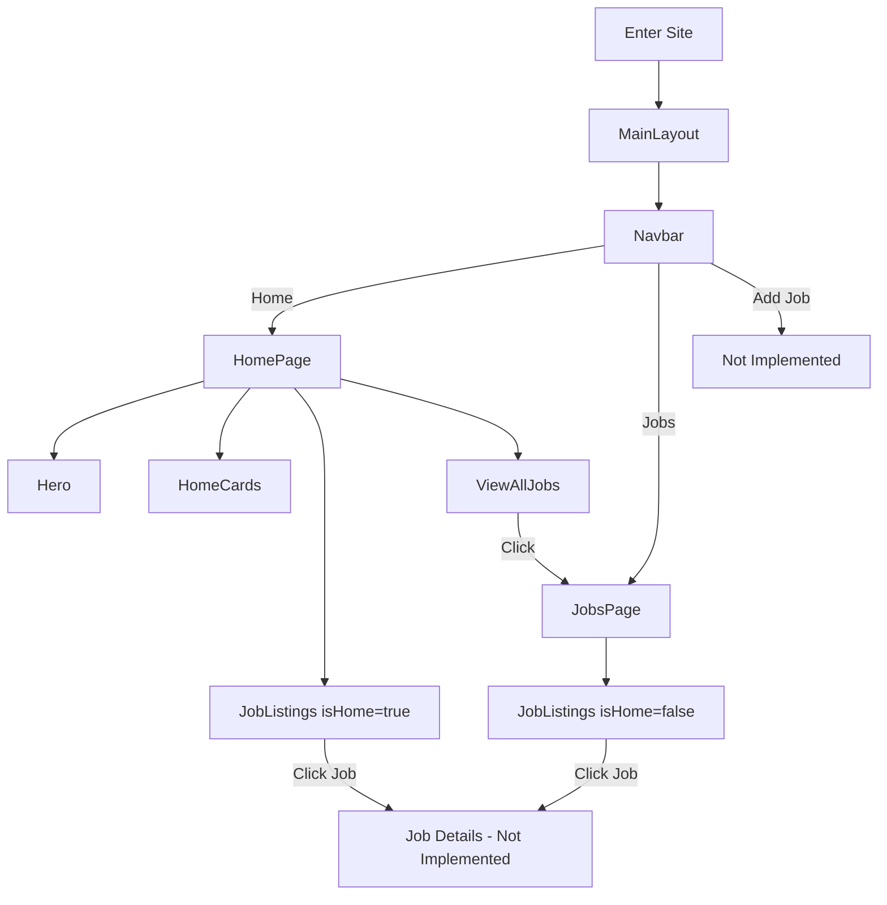

# React Job Site User Flow

## User Flow Description

1. User enters the site and is presented with the MainLayout, which includes the Navbar.
2. From the Navbar, the user can navigate to:
   - Home Page
   - Jobs Page
   - Add Job Page (not implemented)
3. On the Home Page, the user sees:
   - Hero section
   - Home Cards (likely featuring job categories or highlighted jobs)
   - Job Listings (limited selection)
   - View All Jobs button
4. Clicking on "View All Jobs" or the "Jobs" nav item takes the user to the Jobs Page.
5. On the Jobs Page, the user sees a full list of job listings.
6. Clicking on a job listing (on either Home or Jobs page) would likely lead to a Job Details page, but this is not implemented in the current codebase.
7. The "Add Job" functionality is present in the Navbar but not implemented in the routing or components.

Note: The application seems to be in a partially implemented state, with some features like job details and adding jobs not yet developed.